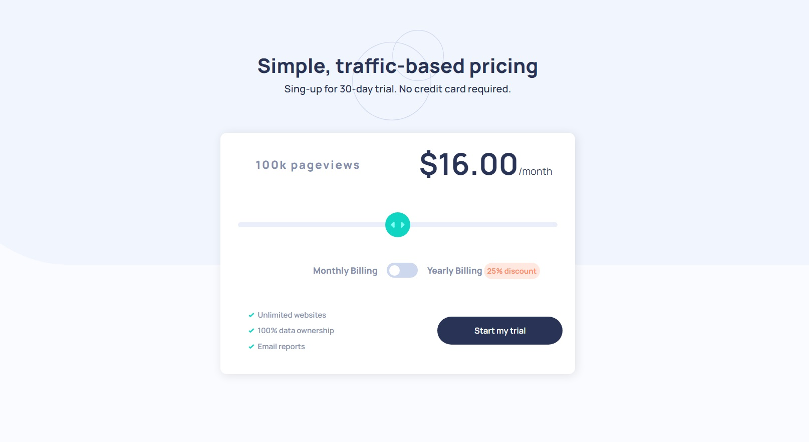

### The challenge

Users should be able to:

- Add their email and submit the form
- See a success message with their email after successfully submitting the form
- See form validation messages if:
  - The field is left empty
  - The email address is not formatted correctly
- View the optimal layout for the interface depending on their device's screen size
- See hover and focus states for all interactive elements on the page
##
### Screenshot

##
### Links

- Solution URL: [https://solution-url.com](https://www.frontendmentor.io/solutions/newsletter-signup-solution-with-html-and-css-6yQpXB6a7Q)
- Live Site URL: [https://live-site-url.com](https://ailtong.github.io/Newsletter-signUp-solution-with-HTML-and-CSS/)
